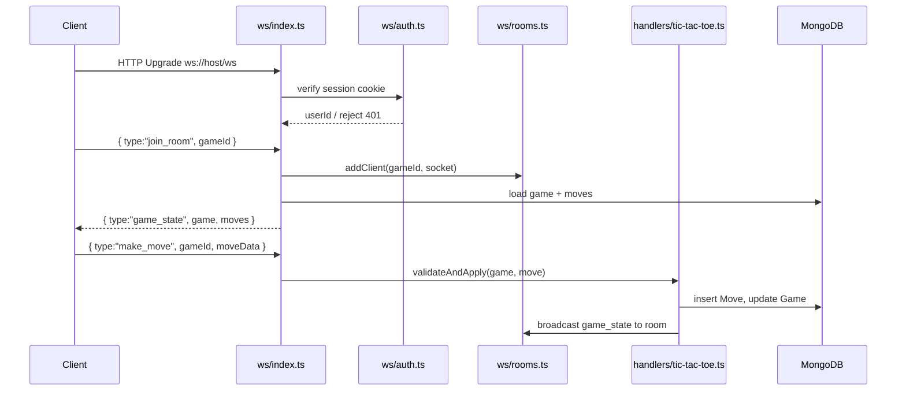

# Tic-Tac-Toe Game Marketplace Plan

## Stack recap
- Next.js 16.2.4 (App Router), MongoDB + Mongoose, better-auth, Hono, custom `server.ts`
- No `ws` package yet — must install `ws` + `@types/ws`

---

## 1. Mongoose Models

Three new files under `database/models/`:

### `user-profile.ts`
Links to better-auth's user by `userId`. Username is assigned on first sign-in.
```ts
{ userId: string, username: string (unique), stats: Map<gameType, { played, won, lost, drawn }>, createdAt }
```

### `game.ts`
Extensible for any game type via `gameType` discriminator string and `gameState` as `Mixed`.
```ts
{
  gameType: string,           // 'tic-tac-toe', 'chess', …
  status: 'waiting'|'active'|'completed'|'abandoned',
  players: [{ userId, username, role }],  // role = 'X'|'O' for ttt
  winner: string | null,      // userId, 'draw', or null
  gameState: Mixed,           // game-specific snapshot JSON
  createdAt, startedAt, completedAt
}
```

TicTacToe `gameState` shape:
```ts
{ board: (null|'X'|'O')[9], currentTurn: 'X'|'O' }
```

### `move.ts`
Separate collection (scales to chess with 80+ moves).
```ts
{ gameId: ObjectId, moveNumber: number, playerId: string, moveData: Mixed, timestamp }
```
TicTacToe `moveData`: `{ row: 0-2, col: 0-2 }`

---

## 2. REST API routes (Hono, registered in `apis/index.ts`)

### `apis/routes/games.ts`
- `POST /api/games` — create a new game (authenticated)
- `GET /api/games/:gameId` — fetch game + moves (public)
- `GET /api/games?gameType=tic-tac-toe&status=waiting` — list open games (public)

### `apis/routes/profiles.ts`
- `GET /api/profiles/:username` — public profile + stats + past games
- `GET /api/profiles/me` — own profile (authenticated)

---

## 3. Auth & post-sign-in redirect

**`app/google-sign-in-button.tsx`** — add `callbackURL: '/profile'` to `authClient.signIn.social(…)`.

**`app/auth/page.tsx`** — change redirect target from `/account` → `/profile` when already signed in.

**`app/profile/page.tsx`** (new, server component):
1. `getServerSession()` → if no session, redirect `/auth`
2. `UserProfile.findOne({ userId })` — if missing, auto-create username from Google display name (slugify + dedup suffix)
3. `redirect('/:username')`

---

## 4. Profile pages

**`app/[username]/page.tsx`** (public, server component — anyone can view):
- Fetch `UserProfile` by username (404 if not found)
- Fetch past games for that user
- Show display name, per-game stats, paginated past games list
- Each past game links to `/games/tic-tac-toe/[gameId]`

---

## 5. Game pages

```
app/games/page.tsx                          — game catalogue home
app/games/tic-tac-toe/page.tsx              — TicTacToe lobby (list open games + "Create game" button)
app/games/tic-tac-toe/[gameId]/page.tsx     — SSR shell (fetches initial game state server-side)
app/games/tic-tac-toe/[gameId]/game-client.tsx — 'use client', holds WS connection + board UI
```

`/games/tic-tac-toe/[gameId]` is public — anonymous visitors can watch; only authenticated users can make moves.

---

## 6. WebSocket layer (`ws/` folder)

```
ws/
  index.ts          — exports attachWebSocketServer(httpServer)
  auth.ts           — authenticate upgrade request via better-auth session cookie
  rooms.ts          — in-memory Map<gameId, Set<AuthedSocket>>
  messages.ts       — TypeScript types for all WS messages
  handlers/
    tic-tac-toe.ts  — move validation, win detection, DB write, broadcast
```

### WS flow



### Message types

Client → Server:
- `{ type: 'join_room', gameId }`
- `{ type: 'make_move', gameId, moveData: { row, col } }`

Server → Client:
- `{ type: 'game_state', game, moves }`
- `{ type: 'move_made', move, gameState }`
- `{ type: 'game_over', winner }` (`winner` = userId or `'draw'`)
- `{ type: 'error', message }`

### Authentication
`ws/auth.ts` calls `getAuth().api.getSession({ headers: new Headers({ cookie: req.headers.cookie }) })`. Unauthenticated upgrades are rejected with HTTP 401 before the WS handshake completes.

---

## 7. `server.ts` update

Add `upgrade` event handler after `listen`:
```ts
httpServer.on('upgrade', (req, socket, head) => {
  wsServer.handleUpgrade(req, socket, head, (ws) => {
    wsServer.emit('connection', ws, req);
  });
});
```
`wsServer` is the `ws.WebSocketServer` from `ws/index.ts`.

---

## Files to create/modify

**Install:** `ws` + `@types/ws`

New files:
- [`database/models/user-profile.ts`](database/models/user-profile.ts)
- [`database/models/game.ts`](database/models/game.ts)
- [`database/models/move.ts`](database/models/move.ts)
- [`ws/index.ts`](ws/index.ts), [`ws/auth.ts`](ws/auth.ts), [`ws/rooms.ts`](ws/rooms.ts), [`ws/messages.ts`](ws/messages.ts)
- [`ws/handlers/tic-tac-toe.ts`](ws/handlers/tic-tac-toe.ts)
- [`apis/routes/games.ts`](apis/routes/games.ts)
- [`apis/routes/profiles.ts`](apis/routes/profiles.ts)
- [`app/profile/page.tsx`](app/profile/page.tsx)
- [`app/[username]/page.tsx`](app/[username]/page.tsx)
- [`app/games/page.tsx`](app/games/page.tsx)
- [`app/games/tic-tac-toe/page.tsx`](app/games/tic-tac-toe/page.tsx)
- [`app/games/tic-tac-toe/[gameId]/page.tsx`](app/games/tic-tac-toe/[gameId]/page.tsx)
- [`app/games/tic-tac-toe/[gameId]/game-client.tsx`](app/games/tic-tac-toe/[gameId]/game-client.tsx)

Modified files:
- [`server.ts`](server.ts) — attach WS upgrade handler
- [`apis/index.ts`](apis/index.ts) — register games + profiles routes
- [`app/google-sign-in-button.tsx`](app/google-sign-in-button.tsx) — `callbackURL: '/profile'`
- [`app/auth/page.tsx`](app/auth/page.tsx) — redirect to `/profile` not `/account`
