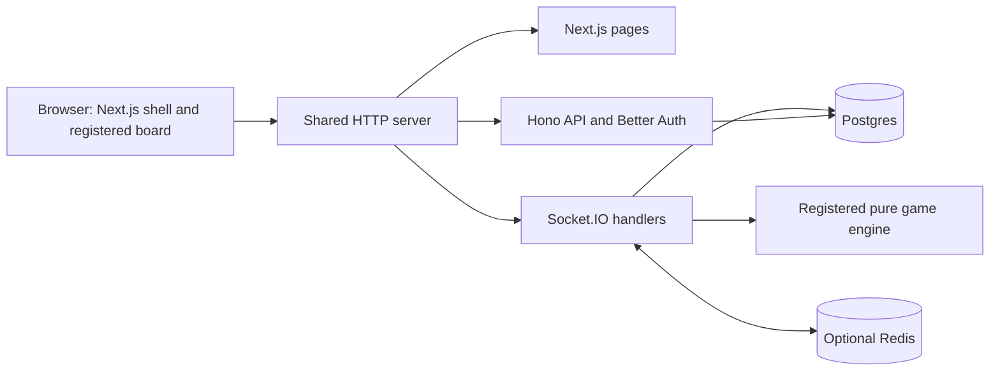

# Repository walkthrough

Read this first, then [Adding a game](adding-a-game.md) when you want to build one. The [architecture index](architecture/README.md) links the detailed subsystem references. Tic-tac-toe and Tank Arena are the currently registered playable games.

## The whole system

Kyzen is a shared social and game platform with small game modules. A game implements rules and a board. The platform owns accounts, rooms, multiplayer synchronization, persistence, chat, profiles, matchmaking, rematches, and shared presentation.



The default app runs on one port, 3000. `apps/web/server.ts` creates the server from `apps/server/src/http.ts`, prepares Next.js, and starts listening. `/api` reaches Hono, `/health` checks readiness, `/socket.io` carries live events, and the remaining HTTP requests reach Next.js. `apps/server/src/index.ts` can mount the same backend independently.

## What each folder owns

| Folder | Responsibility |
| --- | --- |
| `apps/web` | Pages, navigation, application state, chat and profile UI, and the shared play shell |
| `apps/server` | HTTP routes, authentication, social services, sockets, room management, and turn execution |
| `packages/shared` | Zod schemas, wire contracts, types, and constants shared across boundaries |
| `packages/games-core` | Pure game engines, definitions, metadata, and engine registry |
| `packages/games-client` | Registered React boards, shared game sessions, replay and presentation primitives |
| `packages/database` | Drizzle schema, migrations, repositories, and guarded local fixtures |
| `packages/avatar` | Avatar catalogs and validation |
| `vid-tutorials` | Separate Remotion project for tutorial videos, outside the app runtime |
| `scripts` and `.github/workflows` | Verification, maintenance, and documentation publishing |

The server imports game rules and schemas, never React boards. Browser code never imports database repositories. A board receives the current game and a move callback; it does not own a socket. These boundaries are the reason adding another turn-based or simultaneous-round game does not require changing the server or app routes.

## What happens when someone plays

1. Better Auth supplies a session, either a guest identity or a configured Google account. Next.js uses that session for initial page data. The browser's single `SocketProvider` connection authenticates with the same cookie.
2. A player creates an open room, accepts a challenge, starts a conversation-backed game, or enters matchmaking. The platform selects the registered definition, validates configuration, and persists a generic game record and its seats.
3. `/play/[gameId]` loads the snapshot and move history using the public room code. `PlayClient` selects the registered board and calls `useGameSession` once. That session emits `join_room`; the server authorizes access, manages seating, and returns a fresh snapshot.
4. The board renders `game.gameState`. A click calls `makeMove`, for example `{ row: 0, col: 1 }` in tic-tac-toe. The shared session emits `make_move`; the browser does not decide the official result.
5. The server checks the session, seat, input schema, and stored state. The engine's `reduce` rejects an illegal move or returns the next state and outcome. The server persists the move and state, then broadcasts `game_state` to the room.
6. The shared session merges move deltas, filters other rooms, and deduplicates history. The board, waiting overlay, and result overlay receive the same updated game. On reconnect, `join_room` restores the full snapshot and history.
7. A completed game remains available for replay and the rematch flow. The platform manages the series and seating; the board only supplies its presentation.

See [realtime](architecture/realtime.md), [engines](architecture/games-core-engine.md), and [board sessions](architecture/games-client.md) for the implementation details.

## How the shared features mount

`PlayClient` combines the board with waiting/results, transport errors, settings, audio, and profile callbacks. The board calls `onViewProfile` to open the existing profile popup rather than implementing its own profile UI.

When a game has a conversation, `GameChatSplit` mounts the existing `ConversationView` beside it. On desktop the chat can dock on the right, float as a movable window, or minimize to an icon. On mobile the shell switches between game and chat tabs. Mode preferences are persisted to the profile; layout geometry is kept locally. Open rooms without a conversation currently have no attached chat.

Chat, typing, presence, friend updates, and notifications share the same socket connection as games. Their services enforce membership or ownership, persist changes where appropriate, and broadcast updates. Chat data is held in Jotai atoms; the mounted game session keeps its own snapshot and ordered moves. Music comes from game metadata and respects shared audio preferences.

See [web](architecture/web.md), [chat contracts](architecture/chat-core.md), [HTTP services](architecture/server-api.md), [authentication](architecture/auth.md), and [audio](architecture/audio.md).

## What the databases do

Postgres stores durable accounts, profiles, conversations, messages, friendships, notifications, games, players, and moves. Games use common tables with JSONB state, configuration, and move data validated by the registered schemas. Adding a game normally requires no table or migration.

Redis is optional for one app instance. When configured, it supports the socket adapter, presence, and matchmaking coordination. It does not make turn timers durable. Timers are process-local, so the supported realtime deployment currently uses one persistent instance. A process restart loses pending in-memory deadlines.

Database access goes through `packages/database` repositories. HTTP routes and socket handlers call services or repositories; boards never access the database. See [database access](architecture/database.md), [schema](architecture/database-schema.md), and [generic game storage](architecture/generic-game-schema.md).

## Run it and follow a real flow

```bash
docker compose -f compose.dev.yaml up --build --watch
```

This creates local Postgres and Redis, applies the development schema, and loads synthetic fixtures. Open http://localhost:3000 and continue as a guest. Use two independent browser sessions to play a new room. `/play/A2K9P7` is a seeded completed replay; `/demo_sprout` and `/demo_pebble` are fixture profiles, not login accounts. To see mounted chat, use a conversation-backed game between the two signed-in sessions.

Production `docker compose up --build -d` runs only the app, reading external database URLs from `.env`; migrations are explicit. Vercel hosts the frontend with the persistent backend deployed separately. [Deployment](deployment.md) contains the full commands, environment settings, and hosting boundaries.

With the combined app running against local synthetic data, `bun run --cwd apps/web smoke:game` exercises homepage rendering, guest auth, authenticated socket players in tic-tac-toe and Tank Arena (private lobby with a bot, public 1v1 and 2v2), completion, reconnect recovery, and persisted history. [Testing](architecture/testing.md) describes the other checks.

## Add the next game

Implement its schemas in shared, pure rules and metadata in games-core, and board in games-client. Register the slug, definition, and board in the three existing registries. Add engine tests and a rules document. Optional config fields drive the existing setup form; optional music and tutorial assets come from metadata.

Reuse the existing game page, room events, session, database tables, chat placement, profiles, results, and rematches. Follow [Adding a game](adding-a-game.md) for exact paths and contracts, using tic-tac-toe as the working example. Matchmaking sizes each group with the engine's `playerCount(config)`, so a definition can offer 1v1 and team queues. Continuous realtime games need an explicit server runner extension; a `step` method alone is not a playable implementation.

## How the wiki stays current

The Markdown files in `docs/` are the source of truth. `scripts/sync-wiki.mjs` generates the wiki Home, sidebar, architecture pages, game references, and guides, rewriting their relative links. The Sync Wiki workflow publishes them with the repository's publishing integration after relevant changes reach `main`. Edit the repository docs, not generated wiki pages.

Historical specs and plans under `docs/superpowers` describe past decisions. They are not the current setup instructions and are not published as the current wiki.
